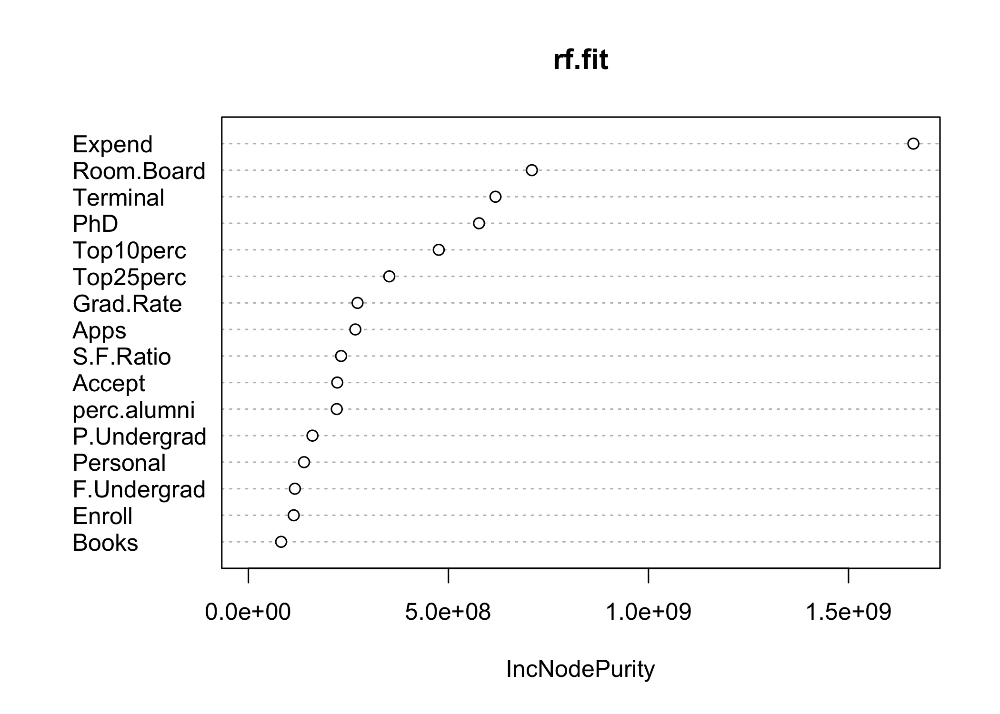
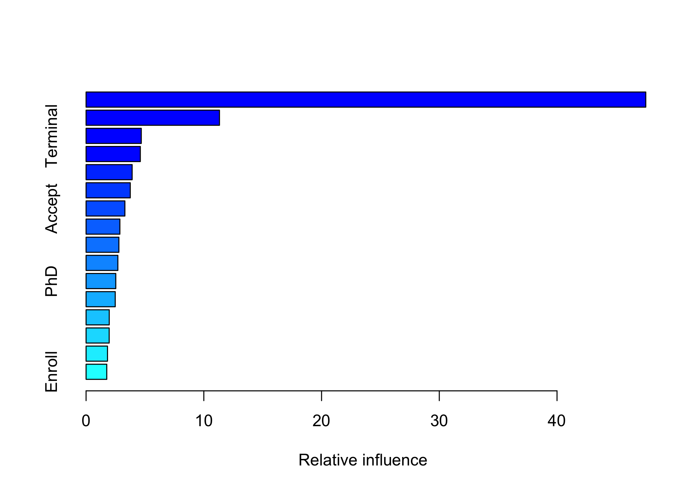

P8106 Data Science II Homework 4: Tree-Based Models
================
Sarah Forrest - sef2183
4/21/2023

# 1. Regression models using the college dataset

In this exercise, we will build tree-based models using the “College”
data. The dataset contains statistics for 565 US Colleges from a
previous issue of US News and World Report. The response variable is the
out-of-state tuition (Outstate).

``` r
# read in data
College <- read.csv("data/College.csv") 

# remove the college variable from the dataset since the data is at the college level and it is the "id" variable
College <- College %>%
  select(-College)
```

Partition the dataset into two parts: training data (80%) and test data
(20%).

``` r
set.seed(1)

# specify rows of training data (80% of the dataset)
trRows <- createDataPartition(College$Outstate, 
                              p = .8,
                              list = F)
# create training dataset
College_train <- College[trRows, ]

# create test dataset
College_test <- College[-trRows, ]
```

## (a) Build a regression tree on the training data to predict the response.

``` r
# create a cross-validation object
ctrl <- trainControl(method = "cv")

set.seed(1)

# build a regression tree on the training data using the caret package
rpart.fit <- train(Outstate ~ . ,
                   data = College_train, # training data
                   method = "rpart", # regression tree model
                   tuneGrid = data.frame(cp = exp(seq(-6,-2, length = 50))), # candidate values for the cp that controls pruning
                   trControl = ctrl)

# create a plot of the complexity parameter selection
ggplot(rpart.fit, highlight = TRUE) # highlight the optimal cp value
```

<!-- -->

### Regression tree model plot

``` r
# create a plot of the tree using the rpart.plot() function
rpart.plot(rpart.fit$finalModel)
```

<!-- -->

## (b) Perform random forest on the training data.

The mtry specification was set to 4, which is the value of the square
root of the number of predictors in the model (16).

``` r
set.seed(1)

# build a random forest model on the training data using the randomForest function
rf.fit <- randomForest(Outstate ~ . ,
                       data = College_train, # training data
                       mtry = 4)
```

### Variable importance

The variable importance values in random forest models indicate the
relative importance of each predictor variable in predicting the outcome
variable. These values are based on the decrease in accuracy of the
model when each variable is randomly permuted. IncNodePurity is a
variable importance measure in the randomForest package that reflects
the reduction in impurity across all trees resulting from splitting on a
particular predictor variable.Higher values for IncNodePurity indicate a
more important predictor variable.

The code below plots and prints the node impurity values for each of the
predictors in the random forest model using the `varImpPlot()` and
`importance()` functions within the randomForest package.

``` r
# plot variable importance
varImpPlot(rf.fit)
```

<!-- -->

``` r
# print variable importance
var_imp <- randomForest::importance(rf.fit)
kable(var_imp)
```

|             | IncNodePurity |
|:------------|--------------:|
| Apps        |     267357034 |
| Accept      |     222163368 |
| Enroll      |     113361209 |
| Top10perc   |     475863152 |
| Top25perc   |     352189394 |
| F.Undergrad |     116233554 |
| P.Undergrad |     160173258 |
| Room.Board  |     708596291 |
| Books       |      81887800 |
| Personal    |     139089871 |
| PhD         |     576493299 |
| Terminal    |     617594289 |
| S.F.Ratio   |     231794692 |
| perc.alumni |     220881662 |
| Expend      |    1662195900 |
| Grad.Rate   |     272825815 |

In the model, the `Expend` and `Room.Board` variables were the most
important predictors, as they have the highest values reported for the
IncNodePurity, followed by `Terminal`, `PhD`, `Top10perc`, and
`Top25perc`. These results suggest that these variables are the most
important drivers of the outcome variable, out-of-state tuition cost
(`Outstate`).

### Test error

The code below used the trained random forest model (rf.fit) to make
predictions on the test dataset. The `predict()` function is used to
generate predictions for the outcome variable `Outstate` based on the
predictor variables in the test dataset. Then, the code calculates the
test error, which is a measure of how well the model performs on new,
unseen data. The test error is calculated as the root mean squared error
(RMSE), which is a measure of the difference between the predicted
values (pred.rf) and the actual values in the test dataset. The lower
the RMSE, the better the model is at predicting the outcome variable on
new data.

``` r
set.seed(1)

# predict on test data
pred.rf <- predict(rf.fit, newdata = College_test) # test data

# calculate the test error (RMSE)
RMSE <- sqrt(mean((College_test$Outstate - pred.rf)^2))
RMSE
## [1] 1646.622
```

The test error of the model is \[\].

## (c) Perform boosting on the training data.

``` r
set.seed(1)

bst.fit <- gbm(Outstate ~ . ,
           data = College_train, # training data
           distribution = "gaussian",
           n.trees = 5000,
           interaction.depth = 3,
           shrinkage = 0.005,
           cv.folds = 10,
           n.cores = 2)

gbm.perf(bst.fit, method = "cv")
```

<!-- -->

    ## [1] 2105

### Variable importance

The code below plots and prints the relative influence variable
importance values for each of the predictors in the in the gradient
boosting model (bst.fit). Higher values for relative influence indicate
more important predictor variables.

``` r
# print variable importance
var_imp <- summary(bst.fit, n.trees = 5000, plot.it = FALSE)
```

<!-- -->

``` r
kable(var_imp)
```

|             | var         |   rel.inf |
|:------------|:------------|----------:|
| Expend      | Expend      | 47.537555 |
| Room.Board  | Room.Board  | 11.330110 |
| Terminal    | Terminal    |  4.689391 |
| Grad.Rate   | Grad.Rate   |  4.607826 |
| perc.alumni | perc.alumni |  3.913773 |
| Apps        | Apps        |  3.754447 |
| Accept      | Accept      |  3.296976 |
| Personal    | Personal    |  2.872145 |
| P.Undergrad | P.Undergrad |  2.787366 |
| S.F.Ratio   | S.F.Ratio   |  2.699871 |
| PhD         | PhD         |  2.523485 |
| F.Undergrad | F.Undergrad |  2.476983 |
| Top10perc   | Top10perc   |  1.968607 |
| Top25perc   | Top25perc   |  1.963394 |
| Books       | Books       |  1.819903 |
| Enroll      | Enroll      |  1.758167 |

In the boosting model, the `Expend`, `Room.Board`, and `Terminal`
variables were the most important predictors. This matches the most
important variables reported in the random forest model. However, rather
than `PhD`, `Top10perc`, and `Top25perc` being the most important
variable folloiwng the first three, `Grad.Rate`, `perc.alumni`, and
`Apps` are the next three most important variables in the boosted model.
The results from the boosted model suggest that differet variables are
the most important drivers of out-of-state tuition cost (`Outstate`) in
comparison to the random forest model.

### Test error

The code below used the trained boosted model (bst.fit) to make
predictions on the test dataset. The `predict()` function is used to
generate predictions for the outcome variable `Outstate` based on the
predictor variables in the test dataset. Then, the test error (RMSE) is
calculated.

``` r
set.seed(1)

# predict on test data
pred.bst <- predict(bst.fit, newdata = College_test, n.trees = 5000) # test data

# calculate the test error (RMSE)
RMSE <- sqrt(mean((College_test$Outstate - pred.bst)^2))
RMSE
## [1] 1686.277
```

The test error of the model is \[\].

# 2. Classification models using the orange juice dataset

This problem uses the OJ data in the ISLR package. The data contains
1070 purchases where the customers either purchased Citrus Hill or
Minute Maid Orange Juice. The dataset includes a number of
characteristics of customers and products.

``` r
# read in data
OJ <- data.frame(OJ)

# transform outcome variable from character to factor with 2 levels
OJ$Purchase <- factor(OJ$Purchase, c("CH", "MM"))
```

Create a training set containing a random sample of 700 observations,
and a test set containing the remaining observations.

``` r
set.seed(1)

# randomly select 700 indices
train_index <- sample(nrow(OJ), 700)

# create training dataset
OJ_train <- OJ[train_index, ]

# create test dataset
OJ_test <- OJ[-train_index, ]
```

## (a) Build a classification tree using the training data, with Purchase as the response and the other variables as predictors.

``` r
# create a cross-validation object
ctrl <- trainControl(method = "cv", 
                     summaryFunction = twoClassSummary,
                     classProbs = TRUE)

set.seed(1)

# build a classification tree using the training data
rpart.fit <- train(Purchase ~ . ,
                   data = OJ_train, # training data
                   method = "rpart",
                   tuneGrid = data.frame(cp = exp(seq(-6,-3, len = 50))), # candidate values for the cp that controls pruning
                   trControl = ctrl,
                   metric = "ROC")

# create a plot of the complexity parameter selection
ggplot(rpart.fit, highlight = TRUE) # highlight the optimal cp value
```

<!-- -->

``` r
# plot the tree with the lowest cross-validation error
rpart.plot(rpart.fit$finalModel)
```

<!-- -->

### Which tree size corresponds to the lowest cross-validation error? Is this the same as the tree size obtained using the 1 SE rule?

The code below prints a table of the complexity parameter (cp) values
correspnding to the lowest cross-validation error and the 1 standard
error rule.

**Lowest cross-validation error**

``` r
rpart.fit$bestTune$cp # reports only the best cp value
## [1] 0.01217752
```

The tree with cp = 0.0122 corresponds to the lowest cross-validation
error.

**1 SE rule**

The tree size obtained using the 1 SE rule is the one with the smalled
value of cp that is within one standard error of the minimum
cross-validation error (ROC).

``` r
# find the tree size obtained using the 1 SE rule
cp.table <- data.frame(rpart.fit$results)
cp.min <- which.min(cp.table$ROC) # finds the index of the row that corresponds to the min ROC
cp.1se <- cp.table$cp[which.min(abs(cp.table$ROC[1:cp.min] - (cp.table$ROC[cp.min] + cp.table$ROCSD[cp.min])))] # calculates the value of cp that corresponds to the 1 SE rule
cp.1se
## [1] 0.01653889
```

The value of cp that is within one standard error of the minimum
cross-validation error is 0.0165. The tree with cp = 0.0165 is obtained
using the 1 SE rule.

Therefore, the tree size obtained using the 1 SE rule is not the same as
the tree size that corresponds to the lowest cross-validation error. The
tree size with the lowest cross-validation error has cp = 0.0122, while
the tree size obtained using the 1 SE rule has cp = 0.0165.

## (b) Perform boosting on the training data and report the variable importance. What is the test error rate?

``` r
OJ_train$Purchase <- as.numeric(OJ_train$Purchase == "CH")
OJ_test$Purchase <- as.numeric(OJ_test$Purchase == "CH")
```

``` r
set.seed(1)

bst.fit <- gbm(Purchase ~ .,
           OJ_train,
           distribution = "adaboost",
           n.trees = 2000,
           interaction.depth = 2,
           shrinkage = 0.005,
           cv.folds = 10,
           n.cores = 2)

gbm.perf(bst.fit, method = "cv")
```

<!-- -->

    ## [1] 859

### Variable importance

The code below plots and prints the relative influence variable
importance values for each of the predictors in the in the boosting
model (bst.fit). Higher values for relative influence indicate more
important variables in predicting the outcome class.

``` r
# report variable importance
var_imp <- summary(bst.fit)
```

<!-- -->

``` r
kable(var_imp)
```

|                | var            |    rel.inf |
|:---------------|:---------------|-----------:|
| LoyalCH        | LoyalCH        | 62.8113385 |
| PriceDiff      | PriceDiff      | 10.5413151 |
| WeekofPurchase | WeekofPurchase |  5.6345731 |
| StoreID        | StoreID        |  4.6292631 |
| ListPriceDiff  | ListPriceDiff  |  2.8238321 |
| SalePriceMM    | SalePriceMM    |  2.7732792 |
| PriceMM        | PriceMM        |  2.0963810 |
| STORE          | STORE          |  1.9959727 |
| SalePriceCH    | SalePriceCH    |  1.3025889 |
| Store7         | Store7         |  0.9791590 |
| DiscCH         | DiscCH         |  0.8485904 |
| SpecialMM      | SpecialMM      |  0.8075967 |
| PriceCH        | PriceCH        |  0.7548687 |
| PctDiscCH      | PctDiscCH      |  0.5944854 |
| DiscMM         | DiscMM         |  0.5338806 |
| SpecialCH      | SpecialCH      |  0.4708679 |
| PctDiscMM      | PctDiscMM      |  0.4020076 |

In the boosting model, the `LoyalCH`, `PriceDiff`, `WeekofPurchase` and
`StoreID` variables were the most important predictors in in predicting
the outcome class.

### Test error

The code below used the trained boosted model (bst.fit) to make
predictions on the test dataset. The predict() function is used to
generate predictions for the outcome variable `Purchase` based on the
predictor variables in the test dataset. Then, the test error (RMSE) is
calculated.

``` r
set.seed(1)

# predict on test data
pred.bst <- predict(bst.fit, newdata = OJ_test, n.trees = 5000) # test data

# calculate the test error (RMSE)
RMSE <- sqrt(mean((OJ_test$Purchase - pred.bst)^2))
RMSE
## [1] 0.9904263
```

The test error of the model is \[\].
